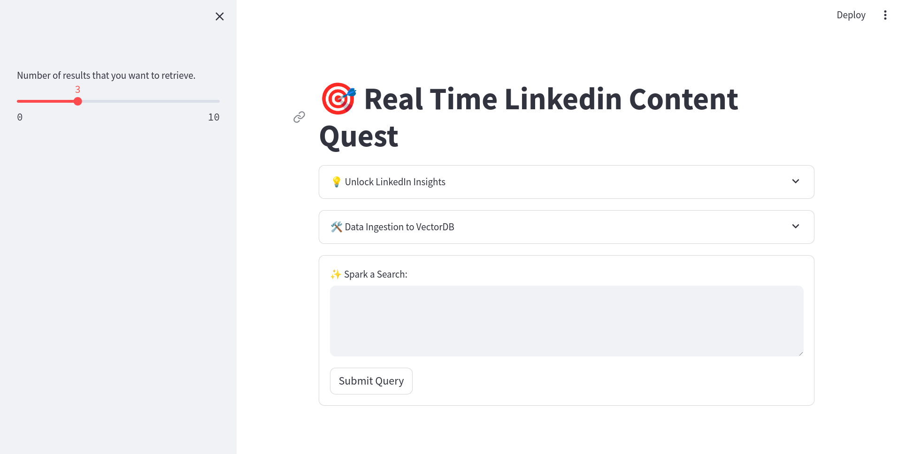

# 🎯 Real Time Social Media Content Retrieval System

## Project Description

The Real Time Social Media Content Retrieval System is a platform designed to retrieve real-time posts from LinkedIn based on user queries. Users can input their query, and the system will fetch relevant posts from LinkedIn in real-time. It allows users to fetch multiple posts and select how many similar results they want to retrieve from the database. While currently limited to LinkedIn posts, the system can be extended to include other social media platforms, enabling users to find similar posts across various social media channels.

## Limitations

Currently, the system only supports live LinkedIn posts retrieval. However, users can extend the functionality to other social media platforms by fetching data and storing it in a specific format in the backend. The fetched data should be stored in JSON files within the `data` folder with the following format:

```json
{
    "Name": "<account_name>",
    "Posts": {
        "<Post_ID>": {
            "text": "<fetched_data>",
            "post_owner": "<account_name>",
            "source": "<social media handle name like Linkedin>"
        }
    }
}
```
## Demo


[Demo Video Link](https://youtu.be/6U0fQdQDXB4?si=eLLx0J55tN2rioiU)

## Technologies Used

The project utilizes several technologies to create a streamlined pipeline:

* **Bytewax:** Used to create a fully streamlined pipeline.
* **Qdrant:** Serves as the vectordatabase, internally built using Rust for faster data processing.
* **Pydantic:** Used for data validation and models.
* **Streamlit:** Provides a simple user interface for the system, developed in Python.
* **Selenium:** To create automation workflow using Python.
* **BeautifulSoup:** Scrape the data from the HTML pages.


## Installation

To run this project on your machine, follow these steps:

1. **Create a virtual environment:**

```bash
python3 -m venv venv
```

2. **Activate the environment:**

  - **Windows:**

  ```bash
  venv\Scripts\activate
  ```

  - **macOS and Linux:**

  ```bash
  source venv/bin/activate
  ```

3. **Install dependencies:**

```bash
pip install -r requirements.txt
```

4. **Ensure Docker is installed and run the Qdrant container:**

```bash
sudo docker run -d -p 6333:6333 -v qdrant_storage:/qdrant/storage qdrant/qdrant
```

5. **Run the Streamlit app:**

```bash
streamlit run app.py
```

6. **Access the UI:**

  Open your web browser and navigate to `localhost:8501` to start using the Real-Time Social Media Content Retrieval System.

## How to Use

To use this app, follow the steps below:

### Step 1: Provide LinkedIn Credentials

1. Add your LinkedIn username, password, and the account username from which you want to fetch the posts.

### Step 2: Fetch LinkedIn Posts

1. Click on the "Fetch Details" button.
2. Wait for some time as the app will automatically open LinkedIn and fetch the posts.

### Step 3: Migrate Data to Vectordb

1. If you have already fetched data and stored it in the Data folder in JSON format, you can directly migrate the data.
2. Ensure that your custom data follows the mentioned JSON format.
3. Use the provided migration tool or script to migrate the data to Vectordb. Follow any instructions or guidelines provided with the migration tool to complete the process.

### Step 4: Search in the Database

1. Once the migration is completed successfully, you can start searching in the database.
2. Access the user interface of the application.
3. From the left-side panel, select the number of results you want to fetch from the database.
4. Enter your query in the search bar and initiate the search.
5. The application will retrieve and display relevant posts from the database based on your query.

## Contribution

Developers are welcome to contribute to this project. Here's how:

1. Fork the repository.
2. Create a new branch for your feature or bug fix.
3. Make your changes and ensure clean code.
4. Write tests for your changes (if applicable).
5. Commit your changes with a descriptive message.
6. Push your branch to your forked repository.
7. Create a pull request with a detailed description of your changes.

## Contact

For any suggestions, comments, or inquiries, please contact `bhikadiyamanthan@gmail.com` or reach out via LinkedIn: `https://www.linkedin.com/in/manthanbhikadiya/`. Your inputs are highly appreciated and will contribute to making this project more beneficial for users.

## Special Mentioned

- Many thanks to **Paul Lusztin** for generously providing the code and an efficient pipeline for the Retrieval Data System. This project wouldn't have been possible without your contribution. I strongly encourage everyone to subscribe to the newsletter.
- Github Repo: https://github.com/decodingml/articles-code/tree/main/articles/large_language_models/real_time_retrieval_system_for_social_media_data
- Newsletter: https://decodingml.substack.com/

